# 🦖 Chrome Dino — Animated SVG for the Profile README

A pixel-faithful reproduction of Chrome's offline T-Rex runner as a **single self-contained animated SVG** (no JavaScript, no external requests), embedded in the profile README with one `` tag.

It runs forever: the dino sprints with the authentic 2-frame run cycle, jumps over cacti of different sizes, and the world cycles day → night (moon + stars) → day. No game over, just running.



---

## Highlights

- **Real Chromium art, not redrawn.** The sprites are the actual `dino_game` assets (extracted from the game's JS, which embeds them as base64), cropped to their exact source rects.
- **~48 KB total**, everything inline (sprites as base64 data URIs, animation as pure CSS).
- **One 36-second master timeline** drives every animation (same duration + `steps`/linear timing), so ground scroll, cacti, jumps, clouds, moon and day/night are perfectly synchronized.
- **Day/night done with opacity crossfades** between two pre-colored "worlds" (day sprites `#535353` ↔ night sprites `#acacac`, background `#f7f7f7` ↔ `#080808`) — mirrors the original game's `.inverted { filter: invert(100%) }` + 1.5s transition, but with properties that are guaranteed to animate inside an ``.

---

## How it's built

### Asset extraction

The classic dino game (`offline.js` family) ships its sprite sheets as base64 inside `runner.js`:

- `1x` sheet — L-mode grayscale (flattened, no alpha)
- `2x` sheet — palette-mode with `black = transparent`, grayscale sprite colors (`#535353` body, light-gray antialiasing fringes)

Use the **2x (HDPI) sheet**. Sprite rectangles come from the game source itself:

| What | Where in source |
|---|---|
| Sprite origins | `spriteDefinition.LDPI / .HDPI` |
| Dino frames | `Trex.animFrames` (RUNNING `[88,132]`, JUMPING `[0]`, DUCKING `[262,321]`) |
| Obstacle types | `Cactus.types` (small 17×35, large 25×50, pterodactyl) |
| Canvas / layout | `defaultDimensions {WIDTH:600, HEIGHT:150}`, `Trex.config` (START_X_POS 50, groundYPos = 150−47−10), `HorizonLine {YPOS:127}` |
| Night mode | `.inverted` CSS (filter invert + 1.5s transition), `Star`/`Moon` configs, `INVERT_DISTANCE` |

> ⚠️ **HDPI coordinates are NOT `2 × LDPI`** — the two sheets are packed differently. Always use the HDPI table against the 2x sheet (verified by scanning actual pixel bounding boxes).

### Files in this repo

| File | Purpose |
|---|---|
| `dino.svg` | The final artifact — drop it anywhere, reference it from any README |
| `build_dino.py` | Generator: extracts/crops sprites, computes all keyframes, emits the SVG |
| `timing.py` | Shared timing model: obstacle schedule + per-obstacle jump-lead selection |
| `preview.py` | Renders static preview frames (Pillow) for eyeballing composition |
| `audit.py` | Replays the CSS timeline in Python and verifies alignment, clearance, day/night windows, ground seam |

### The master timeline (36 s)

- **World speed** 540 px/s (~0.75× the authentic speed — a bit calmer for a README).
- **Ground** — two 1200 px tiles, `translateX(0 → −1200px)` in 2.22 s.
- **Obstacles** — a `<g class="ob">` whose keyframes cross the screen in 2.5 s and idle offscreen the rest of the loop; a negative `animation-delay` places each cactus at its scheduled hit time (every 2 s in the current config, 18 per loop).
- **Jump** — keyframe stops at each scheduled hit minus a per-obstacle *lead* (0.345–0.365 s) so the dino is at/near apex exactly when the cactus passes underneath. Rise 0.27 s / hang 0.12 s / fall 0.25 s, apex 126 px (authentic).
- **Run cycle** — two frames alternate at 12 fps (the original frame rate); the jump pose and run frames swap with `steps(1,end)` masks.
- **Day/night** — crossfade windows at 17 s / 18.5 s / 34.5 s.

---

## Pitfalls & lessons learned

These cost the most debugging time — hopefully this saves someone else the trip.

### 1. `animation-delay` semantics are counterintuitive (the big one)

`animation-delay: -X` does **not** mean "start X seconds later" — it means *"the animation has already been running for X seconds"* (clock = `t + X`).

I generated delays with the opposite convention. Result: cacti arrived 2–4 s **off** from the jump keyframes — the dino "jumped on flat ground" and "passed through cacti". The static preview frames looked perfectly right because the Python simulator used the mirror convention (`clock = t + d` vs CSS `clock = t − delay`).

**Lesson:** simulate with the *same* semantics as the target (CSS), and verify the generated file itself — grep the actual delays/keyframes and recompute the hit times.

### 2. A CSS transform animation overrides the element's `transform` attribute

Putting `transform="translate(0,70)"` on the same element that runs a `translateX` animation silently **loses the Y position** — clouds, moon and stars all collapsed to `y = 0`.

**Fix:** wrap in a static `<g transform="translate(...)">` and animate a child element (no `transform` attribute on the animated element). The dino/ground/obstacles already used this pattern; the background elements didn't.

### 3. Keyframes interpolate — masks need `steps()`

Opacity masks between poses fade instead of switching. The run-mask faded the run cycle *out* during the run phase (and the static jump/standing pose faded *in*), so the dino's legs "stopped moving" most of the time.

**Fix:** `animation-timing-function: steps(1,end)` on the pose-mask animations → hard frame swap at exactly the keyframe boundaries.

### 4. CSS `fill` and `filter` animations are unreliable inside `` SVGs

The first day/night attempt animated `fill` on a `<rect>` and `filter: invert()` on a world group — the background never changed for the viewer (though the keyframes were valid). 

**Fix:** crossfade two pre-colored layers with **opacity only** (opacity/transform are the two properties that always animate). Bonus: the crossfade looks like the original game's 1.5s `transition`.

### 5. Seamless tiling needs seam repair

The original 1200 px ground strip has bump pixels in its **first 8 columns** and none at the end — tiled naively, the wrap point pops (bumps appear/disappear). Fixed by erasing the bump pixels at both tile edges while keeping the continuous ground line.

### 6. Geometry is the limit — a single authentic jump can't clear wide groups

For a 100 px-wide cactus group, the pass (≈0.35 s) is longer than the time the dino's feet stay above the cactus top. The original game gets away with this because its **collision hitboxes are much smaller than the sprites** — visually it's a brief shallow skim.

**Design choice:** removed the un-clearable combinations (large double/triple) and kept the authentic shallow skim on large singles. Small cacti clear with 0 px clip.

### 7. Validating without a browser

No headless browser available → wrote a **timeline auditor** (Python) that replays the CSS math at fine granularity: actual hit times, jump/cactus clearance margins, simultaneous-obstacle spacing, day/night windows, ground-seam continuity. Plus Pillow-rendered static frames with pixel checks. Grep the generated SVG and recompute — never trust the generator's intent over the file's content.

---

## Tuning

| What | Where |
|---|---|
| Cactus frequency | hit times in `timing.py` → `OBSTACLES` (keep gaps ≥ 2.0 s; each obstacle occupies the screen 2.5 s) |
| Obstacle variety | swap entries in `OBSTACLES` (sprite id + `dx` offsets) |
| World speed | `SPEED` in `build_dino.py` / `timing.py` |
| Day/night window | `DAY_END / NIGHT_START / NIGHT_END` in `build_dino.py` |
| Jump feel | `RISE / HANG / FALL / JUMP_H` in `timing.py` |

Rebuild & verify:

```bash
python3 build_dino.py   # -> dino.svg
python3 audit.py        # replay + verify the timeline
python3 preview.py      # -> preview-*.png (static frames)
```

---

## Credits

- Sprites & layout constants: Chromium's `components/neterror/resources/dino_game`, via the faithful port [`jchwl0527/chrome_dino_game`](https://github.com/jchwl0527/chrome_dino_game).
- Built with Python + Pillow; animated with pure CSS (SVG2). No JS, no network requests, no dependencies at render time.
